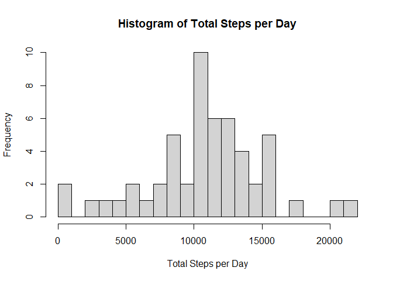
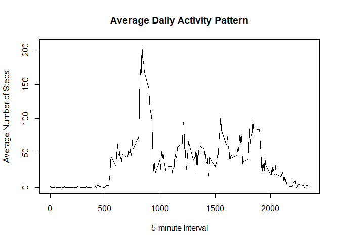
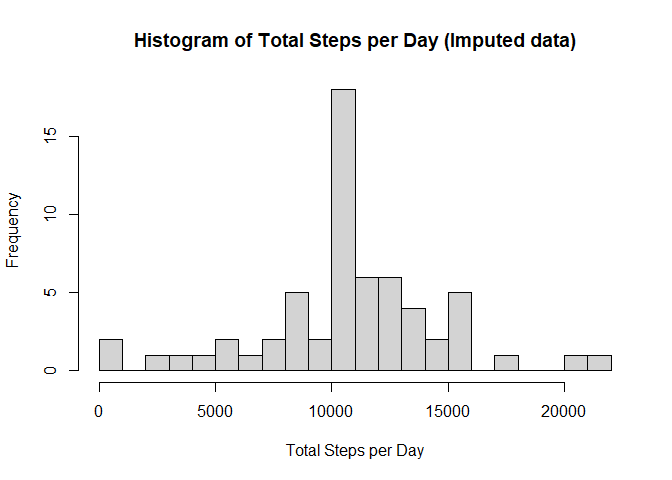
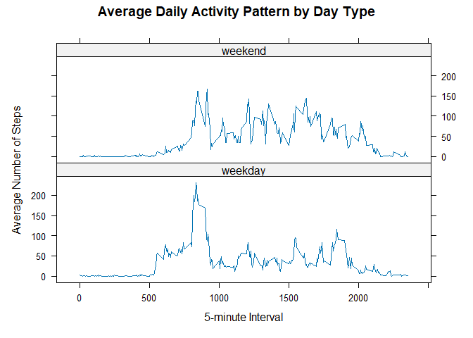

## Loading and preprocessing the data
### Global Settings
We set the global chunk settings.

``` r
knitr::opts_chunk$set(echo = TRUE)
```

### Load data
We load the data from the zip file:

``` r
path_zip_file <- "activity.zip"
unzip(path_zip_file)
activity_data <- read.csv("activity.csv")
```


## What is mean total number of steps taken per day?
We calculate the total number of steps per day.
We do not take missing values into account.

``` r
total_steps_per_day_na <- aggregate(steps ~ date, 
                                    data = activity_data, 
                                    sum, 
                                    na.rm = TRUE)
head(total_steps_per_day_na)
```

```
##         date steps
## 1 2012-10-02   126
## 2 2012-10-03 11352
## 3 2012-10-04 12116
## 4 2012-10-05 13294
## 5 2012-10-06 15420
## 6 2012-10-07 11015
```

Then we plot a histogram:

``` r
hist(total_steps_per_day_na$steps,
     main = "Histogram of Total Steps per Day",
     xlab = "Total Steps per Day",
     breaks = 25)
```

<!-- -->

Finally, we calculate the mean and median of the total number of steps taken per day.

``` r
mean_steps_na <- mean(total_steps_per_day_na$steps)
median_steps_na <- median(total_steps_per_day_na$steps)

mean_steps_na_formatted <- format(mean_steps_na, scientific = FALSE)
```
The average is 10766.19 steps, the median is 10765 steps.


## What is the average daily activity pattern?
To plot the average daily activity pattern, we aggregate all the steps per time-interval and divide by the number of measurements.
We assume here that missing values do not contibute to the average.

``` r
average_steps_per_interval <- aggregate(steps ~ interval, 
                                        data = activity_data, 
                                        FUN = mean, 
                                        na.rm = TRUE)

plot(average_steps_per_interval$interval,
     average_steps_per_interval$steps,
     type = "l",
     xlab = "5-minute Interval",
     ylab = "Average Number of Steps",
     main = "Average Daily Activity Pattern")
```

<!-- -->

We then compute the 5-minute interval, which on average has the highest number of steps.

``` r
interval_max <- average_steps_per_interval[which.max(average_steps_per_interval$steps), ]
```
The result is interval 835 with an average of 206.1698113 steps.

## Imputing missing values
### Missing values
Our data contains missing values ("NA"). 
We calculate the number of samples (data rows) with missing values.

``` r
num_rows_with_NA <- sum(!complete.cases(activity_data))
```

The total number of rows with missing values is: 2304.

### Data imputation
We replace the missing values with the average of each time interval.
We temporarily add the average steps per interval to the table and later remove this column.

``` r
activity_data_imp <- merge(activity_data, 
                           average_steps_per_interval, 
                           by = "interval", 
                           suffixes = c("", "_mean"))

na_indices <- is.na(activity_data_imp$steps)
activity_data_imp$steps[na_indices] <- activity_data_imp$steps_mean[na_indices]
activity_data_imp$steps_mean <- NULL

num_rows_with_NA_after_imp <- sum(!complete.cases(activity_data_imp))
```
We can confirm there are: 0 NA values in the table.

### Data imputation analysis
We plot a histogram of the total number of steps taken each day of the imputed data.

``` r
total_steps_per_day_imp <- aggregate(steps ~ date, 
                                     data = activity_data_imp, 
                                     sum, 
                                     na.rm = TRUE)

hist(total_steps_per_day_imp$steps,
     main = "Histogram of Total Steps per Day (Imputed data)",
     xlab = "Total Steps per Day",
     breaks = 25)
```

<!-- -->

The effect of imputing missing data on the estimates of the total daily number of steps can be seen in the histograms.
Compared to the histogram with missing data, the days where few steps were made have decreased and more days with more steps have increased.
This is because we have offset the sum of steps per day via data imputation.

We then compute the mean and median total number of steps per day.

``` r
total_steps_per_day_imp <- aggregate(steps ~ date, 
                                     data = activity_data_imp, 
                                     sum, 
                                     na.rm = TRUE)

mean_steps_imp <- mean(total_steps_per_day_imp$steps)
median_steps_imp <- median(total_steps_per_day_imp$steps)

mean_steps_imp_formatted <- format(mean_steps_imp, scientific = FALSE)
median_steps_imp_formatted <- format(median_steps_imp, scientific = FALSE)
```

Before data imputation, the mean and average were 10766.19 and 10765 respectfully.
After data imputation, the mean and average are 10766.19 and 10766.19 respectfully.
This means remain the same, because the average per 5-minute interval is used to replace missing values, which preserves the means of the dataset (when we drop missing values).
The median has changed, because the added values do not distribute evenly around the prior median value.

## Are there differences in activity patterns between weekdays and weekends?
We split the data into weekdays and weekend days. 
For this we, create an extra factor variable that indicates if a date is a weekday or falls in the weekend.

``` r
activity_data_imp$day_type <- ifelse(
  weekdays(as.Date(activity_data_imp$date)) %in% c("Saturday", "Sunday"),
  "weekend", "weekday")
activity_data_imp$day_type <- factor(activity_data_imp$day_type, 
                                     levels = c("weekday", "weekend"))
```

Then we calculate the average number of steps taken per time interval for weekdays and weekends and plot the time series.

``` r
library(lattice)
average_steps_by_type <- aggregate(steps ~ interval + day_type, 
                                   data = activity_data_imp, 
                                   FUN = mean)

xyplot(steps ~ interval | day_type, 
       data = average_steps_by_type, 
       type = "l", 
       layout = c(1, 2),
       xlab = "5-minute Interval", 
       ylab = "Average Number of Steps",
       main = "Average Daily Activity Pattern by Day Type")
```

<!-- -->

